# Aspect-Based Sentiment Analysis of Tweets Directed at Brands and Products using Natural Language Processing.

# 1 Business Understanding 
## 1.1 Business Overview
Social media platforms like Twitter are where people openly share their thoughts, complaints, and praise about products and brands. These conversations show how customers truly feel and what matters to them. For big companies like Apple and Google, understanding this feedback is key to improving products and maintaining a strong brand image.

According to Aga Khan University (2022),https://ecommons.aku.edu/cgi/viewcontent.cgi?article=1069&context=etd_ke_gsmc_ma-digjour, analyzing social media discussions gives organizations valuable insights into consumer attitudes and market trends that support smarter business decisions. Listening to what people say online helps companies respond faster, build trust, and stay connected to their customers.

## 1.2 Problem Statement
Apple and Google continuously monitor customer satisfaction to stay ahead in the technology market. However, given the massive volume and speed of data generated on Twitter, manual tracking of sentiment is impractical. Without automated systems, valuable insights into customer satisfaction, emerging issues, and product perception may be overlooked.

This project aims to address this challenge by developing a machine learning model capable of classifying tweets related to Apple and Google as positive, negative, or neutral. The outcome will support organizations in understanding real-time consumer opinions, measuring brand perception, and identifying areas for improvement based on public feedback.

## 1.3 Business Objective
### 1.3.1 Main objective:
To develop an NLP-based sentiment analysis model that automatically classifies tweets about Apple and Google into positive, negative, or neutral categories.

### 1.3.2 Specific objectives:
1. To explore and clean the tweet dataset, handling missing values, duplicates, and irrelevant characters.

2. To preprocess textual data through tokenization, stopword removal, and lemmatization.

3. To convert cleaned text into numerical features using appropriate vectorization techniques such as TF-IDF or Word2Vec.

4. To train and evaluate multiple classification algorithms (e.g., Logistic Regression, Naive Bayes, SVM) to identify the best-performing model.

5. To interpret and visualize model predictions, identifying which features most influence positive and negative sentiment.

6. To provide actionable insights that can guide Apple and Google in improving customer experience and brand perception.
## 1.4 Research Questions
1. How can the dataset be explored and cleaned to ensure data quality and reliability for sentiment analysis?

2. What preprocessing techniques are most effective for preparing Twitter text data for modeling?

3. Which text vectorization method (e.g., TF-IDF) produces better numerical representations for tweet classification?

4. Which classification algorithms yield the highest accuracy and robustness in predicting tweet sentiment?

5. Which textual features (words, phrases, or hashtags) most strongly influence model predictions of sentiment?

6. How can the resulting sentiment insights be applied by Apple and Google to improve customer satisfaction and brand reputation?
## 1.5 Success Criteria
Model Performance: Achieve at least 85% classification accuracy and a macro F1-score ≥ 0.80 across all sentiment classes (positive, negative, neutral).

Model Interpretability: Clearly explain which features (words, hashtags, expressions) most affect sentiment predictions using tools such as LIME or SHAP.

Business Value: Provide insights that help Apple and Google understand customer sentiment, identify common issues, and track brand reputation effectively


## 2. Data Understanding
### 2.1 Data overview
The dataset contains 9,093 tweets collected from crowdFlower, with the goal of identifying whether the emotion in a tweet is directed at a brand or product, and if so, what sentiment it carries. It includes 3 columns,
- tweet_text:  The raw text of the tweet, expressing user opinions or emotions.
- emotion_in_tweet_is_directed_at: The specific brand or product the emotion is directed at (if identified)
- is_there_an_emotion_directed_at_a_brand_or_product: Indicates whether the tweet expresses emotion toward a brand/product


### data characteristics
- Number of rows: 9,093
- Number of columns: 3
- Data types: All columns are of type object (textual).
- Target variable: is_there_an_emotion_directed_at_a_brand_or_product.
- Feature variable: tweet_text.
- Filtering scope: Tweets directed at Apple or Google will be selected for analysis.

our target variable includes various sentiment  labels such as Positive emotion, Negative emotion, and No emotion toward brand or product.


```python
#Importing libraries
import pandas as pd
import numpy as np
import seaborn as sns
import matplotlib.pyplot as plt
import warnings
import re
warnings.filterwarnings('ignore')
```


```python
df = pd.read_csv("judge-1377884607_tweet_product_company.csv", encoding="latin1")

df.info()
```

    <class 'pandas.core.frame.DataFrame'>
    RangeIndex: 9093 entries, 0 to 9092
    Data columns (total 3 columns):
     #   Column                                              Non-Null Count  Dtype 
    ---  ------                                              --------------  ----- 
     0   tweet_text                                          9092 non-null   object
     1   emotion_in_tweet_is_directed_at                     3291 non-null   object
     2   is_there_an_emotion_directed_at_a_brand_or_product  9093 non-null   object
    dtypes: object(3)
    memory usage: 213.2+ KB
    
All columns are object type,the tweet_text has i missing row,the emotion directed at column has alot of missing values with only 3291 non-null.

df['is_there_an_emotion_directed_at_a_brand_or_product'].unique().tolist()

    ['Negative emotion',
     'Positive emotion',
     'No emotion toward brand or product',
     "I can't tell"]

The target variable contains 4 sentiment classes.The Negative emotion,Positive emotion,No emotion toward brand or product and the i can't tell.

### Handling missing values
After identifying the missing values based on their percentages and importance of the column we will drop the single missing row.
# handling missing values
# Dropping the single missing row in tweet_text
df = df.dropna(subset=['tweet_text'])
df.isnull().sum()

    tweet_text                                               0
    emotion_in_tweet_is_directed_at                       5788
    is_there_an_emotion_directed_at_a_brand_or_product       0
    dtype: int64

# Filtering the "emotion is directed at" to Keep Apple and Google tweets only.
df = df[df['emotion_in_tweet_is_directed_at'].isin(['Apple', 'Google'])]

```python
# Tweet length analysis(number of characters in tweet)
df['tweet_length'] = df['tweet_text'].str.len()
df

# adding the number of words in tweet column
df['word_count'] = df['tweet_text'].apply(lambda x: len(str(x).split()))
df
```python
# View summary statistics
print(df['tweet_length'].describe())
```

    count    1087.000000
    mean      107.690892
    std        28.154731
    min        37.000000
    25%        86.000000
    50%       113.000000
    75%       130.000000
    max       170.000000
    Name: tweet_length, dtype: float64
 
```python
# tweet length distribution plot
plt.boxplot(df['tweet_length'])
plt.title('Tweet Length Distribution')
plt.ylabel('Number of Characters')
plt.show()
```  
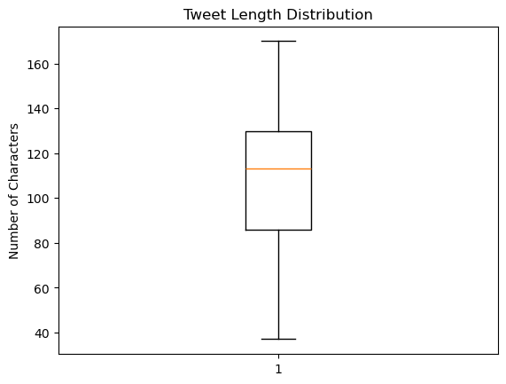
    

```python
# plotting for sentiment distribution by brand
plt.figure(figsize=(8,5))
sns.countplot(x='emotion_in_tweet_is_directed_at', hue='is_there_an_emotion_directed_at_a_brand_or_product', data=df)
plt.title('Sentiment Distribution by Brand')
plt.xlabel('Brand')
plt.ylabel('Tweet Count')
plt.legend(title='Sentiment')
plt.show()

``` 
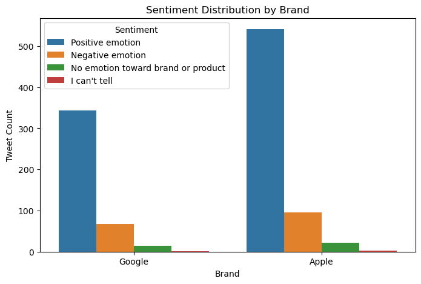
    
From the distribution of sentiments both brands get a mix of sentiments with the I cant tell being the least ,the positive sentiments dominates in both brands but the Apple brand recieves more positive sentiments compared to the Google brand.

```python
# Visualizing the distribution of emotion labels helps identify class imbalance.
# This guides modeling decisions such as resampling or weighting during training.

# Check the distribution of the target variable
df['is_there_an_emotion_directed_at_a_brand_or_product'].value_counts().plot(kind='bar', color='#1f77b4')
plt.title('Distribution of Emotion Labels')
plt.xlabel('Emotion Directed at Brand or Product')
plt.ylabel('Count')
plt.show()

``` 
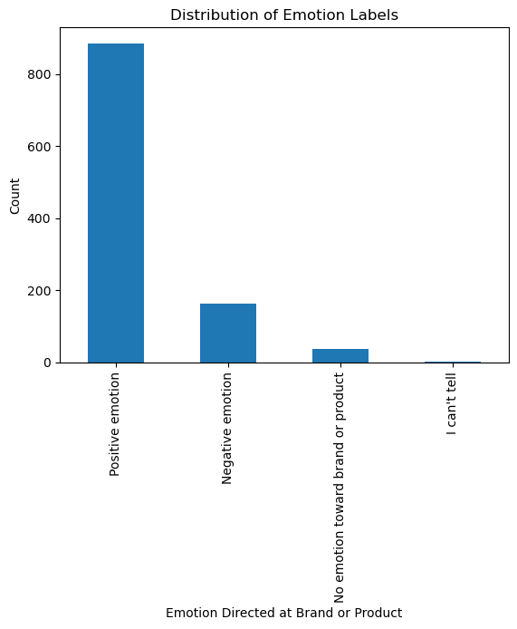
    

```python
# visualizing the distribution of tweet lengths
plt.figure(figsize=(8,5))
plt.hist(df['tweet_length'], bins=30, edgecolor='black')
plt.title('Distribution of Tweet Lengths')
plt.xlabel('Tweet Length')
plt.ylabel('Frequency')
plt.show()

```
 
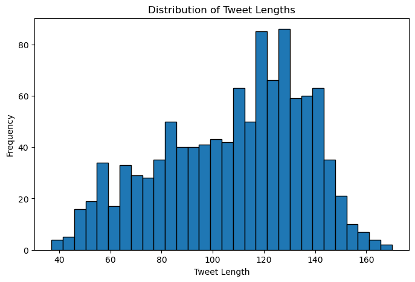


```python
# plotting a more visual histogram plot for range analysis.
# Basic histogram
plt.figure(figsize=(8,5))
plt.hist(df['tweet_length'], bins=30, edgecolor='black', alpha=0.7)
plt.title('Distribution of Tweet Lengths')
plt.xlabel('Tweet Length')
plt.ylabel('Frequency')

# Calculating percentiles
q1 = df['tweet_length'].quantile(0.25)
median = df['tweet_length'].median()
q3 = df['tweet_length'].quantile(0.75)

# Adding vertical lines for Q1, Median, Q3 for clear data interpretation.
plt.axvline(q1, color='red', linestyle='--', label=f'Q1 = {q1:.0f}')
plt.axvline(median, color='green', linestyle='--', label=f'Median = {median:.0f}')
plt.axvline(q3, color='blue', linestyle='--', label=f'Q3 = {q3:.0f}')

plt.legend()
plt.show()

```
    
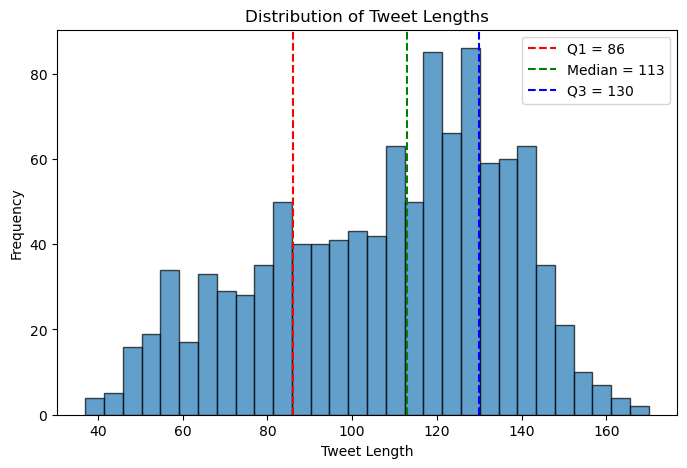
    
The distribution of tweet lengths is fairly concentrated, with most tweets ranging between approximately 80 and 130 characters. This range corresponds to the interquartile range (Q1–Q3), indicating that the majority of tweets are of moderate length.

## TEXT PREPROCESSING
```python
import seaborn as sns
import emoji
from nltk.corpus import stopwords
from sklearn.model_selection import train_test_split
from sklearn.feature_extraction.text import TfidfVectorizer
from sklearn.linear_model import LogisticRegression
from sklearn.metrics import (
    classification_report,
    confusion_matrix,
    accuracy_score,
    f1_score
)
from sklearn.pipeline import Pipeline
import joblib
import warnings
from sklearn.feature_extraction.text import CountVectorizer
import nltk
from nltk.tokenize import word_tokenize
from nltk.stem import WordNetLemmatizer
from wordcloud import WordCloud
from nltk.stem.porter import PorterStemmer #reduce the word to its root form
from nltk.corpus import stopwords, wordnet
warnings.filterwarnings("ignore")
# Ensure required NLTK resources are downloaded
nltk.download('punkt', quiet=True)
nltk.download('wordnet', quiet=True)
nltk.download('omw-1.4', quiet=True)
# Download stopwords
nltk.download('stopwords', quiet=True)

```
    True

```python

# Initialize tools
STOP_WORDS = set(stopwords.words('english'))
lemmatizer = WordNetLemmatizer()

def preprocess_tweet(text, keep_emojis=False):
    """
    Clean, tokenize, remove stopwords, and lemmatize a tweet.
    Returns a cleaned string ready for modeling.
    """
    if not isinstance(text, str):
        return ""

    # 1. Convert to lowercase
    text = text.lower()

    # 2convert emojis to text form
    if keep_emojis:
        text = emoji.demojize(text)

    # 3.Remove URLs, mentions, and hashtags
    text = re.sub(r"http\S+|www\S+|https\S+", '', text)
    text = re.sub(r"@\w+", '', text)
    text = re.sub(r'#', '', text)  # removing only the '#' symbol and keeps the hashtag word

    # 4.Removing non-alphabetic characters
    text = re.sub(r"[^a-z\s]", ' ', text)

    # 5.Tokenization
    tokens = word_tokenize(text)

    # 6. Remove stopwords and short tokens
    tokens = [word for word in tokens if word not in STOP_WORDS and len(word) > 1]

    # 7.Lemmatization
    tokens = [lemmatizer.lemmatize(word) for word in tokens]

    # 8.Joinning back to a single string
    clean_text = " ".join(tokens)

    return clean_text.strip()  # Removes any leading/trailing spaces

```


```python
# Applying the preprocessing function to each tweet in 'tweet_text'
# stores the cleaned output in a new column 'cleaned_tweet'
df['cleaned_tweet'] = df['tweet_text'].apply(lambda x: preprocess_tweet(x, keep_emojis=True))
```


```python
# Remove rows where the cleaned tweet is empty or contains only whitespace.
df = df[df['cleaned_tweet'].str.strip() != ""]

```

```python
# Preview of the original vs cleaned tweets
df[['tweet_text', 'cleaned_tweet']].sample(5, random_state=42)

```

```python
top_words = word_counts.head(10)
plt.figure(figsize=(10,6))
sns.barplot(x='count', y='word', data=top_words, palette='rocket')
plt.title("Top 10 Words")
plt.xlabel("Count")
plt.ylabel("Word")
plt.show()

```
  
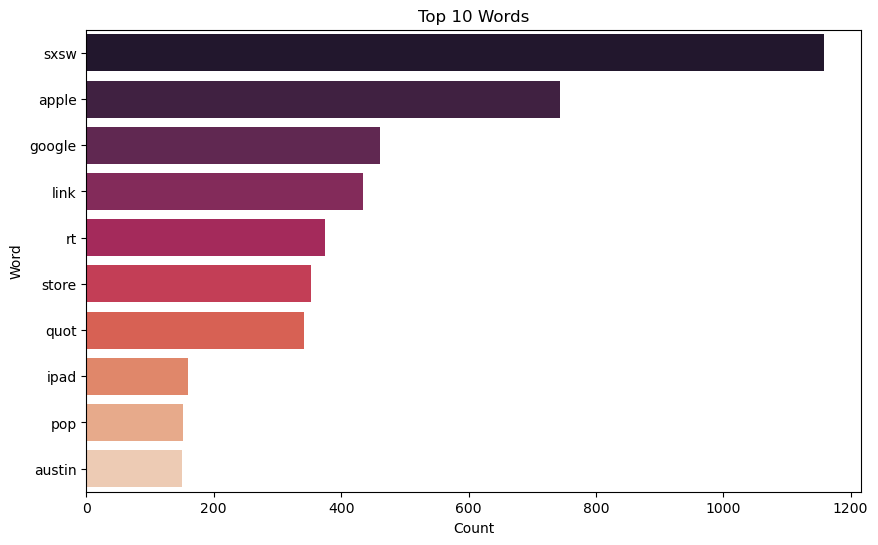
    

```python

# Combining all cleaned tweets into a single string
text = " ".join(df['cleaned_tweet'])

# Creating a WordCloud to display top 100 words
wordcloud = WordCloud(
    width=800,
    height=400,
    background_color='white',
    stopwords=STOP_WORDS,
    max_words=100
).generate(text)

# Plot
plt.figure(figsize=(15,7))
plt.imshow(wordcloud, interpolation='bilinear')
plt.axis('off')
plt.title("WordCloud of Tweets", fontsize=20)
plt.show()

```

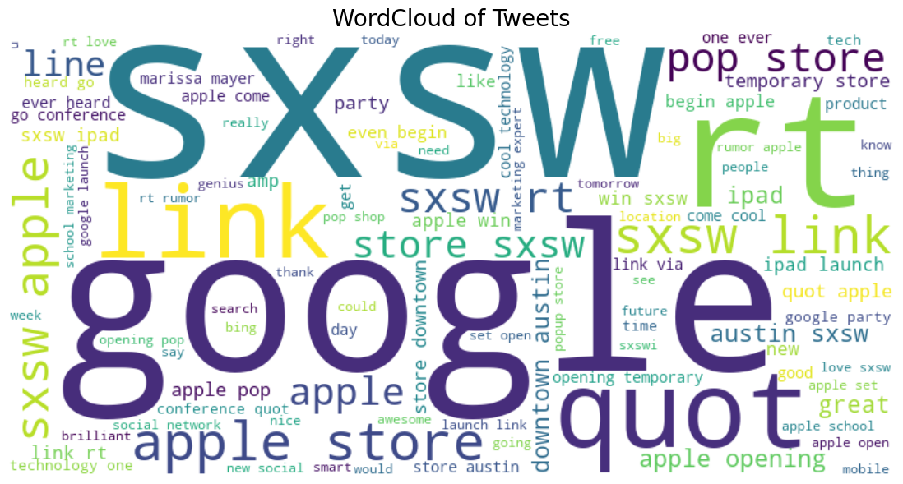
    
words like google and SXSW ,link and apple seem to have the most appearances . 

#### Target Variable Mapping

```python
# Target Variable Mapping
def map_manual_sentiment(label):
    if label == 'Positive emotion':
        return 'Positive'
    elif label == 'Negative emotion':
        return 'Negative'
    else:
        return 'Neutral'

df['manual_sentiment'] = df['is_there_an_emotion_directed_at_a_brand_or_product'].apply(map_manual_sentiment)

```

## BASELINE SENTIMENT ANALYSIS (VADER)
```python
# Visualizing the proportions of sentiments by Vader using a pie-chart
fig, ax = plt.subplots()
colors = ('#1f77b4',"#f58f36","#EE0B38")
sentiment_props = df['vader_sentiment'].value_counts()
ax.pie(sentiment_props.values, colors=colors, labels=sentiment_props.index, autopct="%1.1f%%", startangle=90)
plt.title("Proportion of Sentiments by Vader Lexicon",fontsize=14, fontweight='bold')
plt.legend(loc='upper right')
plt.show()
```   
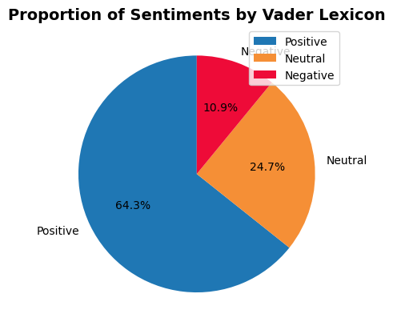
    
Distribution of sentiments on a pie chart showing the positive class is dominating with 64.3% ,followef by the Neutral with 24.7% and the Negative being the least with 10.9%.

## ADVANCED MODELLING

#### Handling class imbalance

```python
# Checking class distribution
class_counts_before = df['manual_sentiment'].value_counts()
class_counts_before
```
    manual_sentiment
    Positive    885
    Negative    163
    Neutral      39
    Name: count, dtype: int64

From the class distribution,the classes are imbalanced ,therefore before beginning our modelling we will first balance the classes

# Checking the distribution
df_balanced_model['manual_sentiment'].value_counts(normalize=True)


    manual_sentiment
    Positive    0.333333
    Negative    0.333333
    Neutral     0.333333
    Name: proportion, dtype: float64

From the output ,we can see the sentiment classes are now balanced ,this ensures our model will not be biased.

#Visualiznig the before and after balancing distribution of the sentiment classes.
fig, axes = plt.subplots(1, 2, figsize=(12, 5))
# Before balancing
df_model['manual_sentiment'].value_counts().plot(kind='bar', ax=axes[0], color='#ff7f0e')
axes[0].set_title('Before Balancing')
axes[0].set_xlabel('Sentiment Category')
axes[0].set_ylabel('Count')

# After balancing
df_balanced_model['manual_sentiment'].value_counts().plot(kind='bar', ax=axes[1], color='#1f77b4')
axes[1].set_title('After Balancing')
axes[1].set_xlabel('Sentiment Category')
axes[1].set_ylabel('Count')

plt.tight_layout()
plt.show()

```

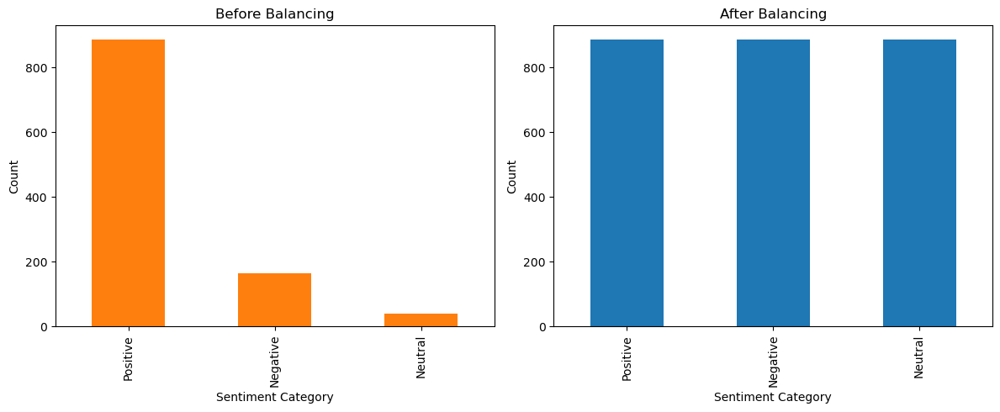

# splitting the data
X = df_balanced_model['cleaned_tweet']
y = df_balanced_model['manual_sentiment']

## TEXT VECTORIZATION


```python
# Converting textual data into numerical data using TF-IDF
tfidf = TfidfVectorizer(max_features=5000, ngram_range=(1,2))

 #Fitting the vectorizer on training data and transform it into TF-IDF numerical features
X_train_tfidf = tfidf.fit_transform(X_train)
# Transform test data into TF-IDF numerical features
X_test_tfidf = tfidf.transform(X_test)

```

### 1. Baseline logistic regression 


```python
# Create a Logistic Regression pipeline
lr_pipeline = Pipeline([
    ('tfidf', TfidfVectorizer(max_features=5000, ngram_range=(1, 2))),
    ('logreg', LogisticRegression(max_iter=1000))
])

# Plot the learning curve
plt.figure(figsize=(8,5))
plt.plot(train_sizes, train_mean, 'o-', color='blue', label='Training Accuracy')
plt.plot(train_sizes, test_mean, 'o-', color='#ff7f0e', label='Validation Accuracy')
plt.title('Learning Curve - Logistic Regression')
plt.xlabel('Training Set Size')
plt.ylabel('Accuracy')
plt.legend(loc='best')
plt.grid(True)
plt.show()

```

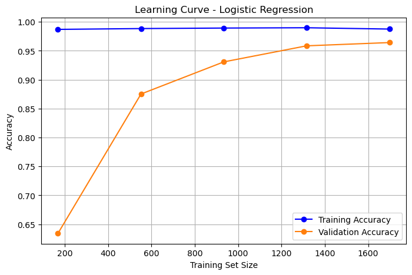
    
From the small gap at the ends of the Training and Validation shows the model is perfoming well and not overfitting.

```python
# Extract TF-IDF feature names and the trained Logistic Regression model
vectorizer = lr_pipeline.named_steps['tfidf']
model = lr_pipeline.named_steps['logreg']

feature_names = vectorizer.get_feature_names_out()

# For multi-class, get coefficients for each class
for i, class_label in enumerate(model.classes_):
    coefficients = model.coef_[i]
    top_positive_words = [feature_names[j] for j in np.argsort(coefficients)[-10:]]
    top_negative_words = [feature_names[j] for j in np.argsort(coefficients)[:10]]

    print(f"\nClass: {class_label}")
    print("Top words influencing positive sentiment:", top_positive_words)
    print("Top words influencing negative sentiment:", top_negative_words)

```

    
    Class: Negative
    Top words influencing positive sentiment: ['rt temporary', 'google circle', 'company', 'attention', 'fascist company', 'america', 'company america', 'fascist', 'fail', 'rt google']
    Top words influencing negative sentiment: ['link', 'party', 'sxsw link', 'pop', 'austin', 'popup', 'wow', 'store', 'love', 'going']
    
    Class: Neutral
    Top words influencing positive sentiment: ['link', 'actual', 'link sxsw', 'apple like', 'austin', 'pop', 'wow rt', 'rt pop', 'quot party', 'launch']
    Top words influencing negative sentiment: ['day', 'rt google', 'temporary', 'opening', 'quot apple', 'get', 'sxswi', 'apple opening', 'great', 'store downtown']
    
    Class: Positive
    Top words influencing positive sentiment: ['store downtown', 'opening', 'smart', 'marketing', 'cool', 'set', 'amp', 'great', 'link', 'love']
    Top words influencing negative sentiment: ['quot', 'launch', 'like', 'apple like', 'want', 'location', 'first', 'seems', 'quot party', 'fail']
    

## SUPPORT VECTOR MACHINE (SVM)

why SVM?

Logistic Regression gave strong baseline results, but SVM is often better at handling complex, high-dimensional text data like TF-IDF. It can pick up on subtle differences between sentiments—especially Neutral and Negative—so it’s a good choice to compare against the baseline.


```python
from sklearn.pipeline import Pipeline
from sklearn.feature_extraction.text import TfidfVectorizer
from sklearn.svm import LinearSVC

# Build the SVM pipeline
svm_pipeline = Pipeline([
    ('tfidf', TfidfVectorizer(max_features=5000, ngram_range=(1, 2))),
    ('svm', LinearSVC(random_state=42))
])


```

checking for overfitting in the SVM MODEL


# Generate learning curve data for SVM pipeline
train_sizes, train_scores, test_scores = learning_curve(
    svm_pipeline, X, y, cv=5, scoring='accuracy', n_jobs=-1, train_sizes=np.linspace(0.1, 1.0, 5), random_state=42
)

# Compute mean and standard deviation
train_mean = np.mean(train_scores, axis=1)
train_std = np.std(train_scores, axis=1)
test_mean = np.mean(test_scores, axis=1)
test_std = np.std(test_scores, axis=1)

# Plot
plt.figure(figsize=(8,6))
plt.plot(train_sizes, train_mean, 'o-', color='blue', label='Training Score')
plt.plot(train_sizes, test_mean, 'o-', color='#ff7f0e', label='Cross-Validation Score')
plt.fill_between(train_sizes, train_mean - train_std, train_mean + train_std, color='blue', alpha=0.1)
plt.fill_between(train_sizes, test_mean - test_std, test_mean + test_std, color='#ff7f0e', alpha=0.1)
plt.title("SVM Learning Curve")
plt.xlabel("Training Set Size")
plt.ylabel("Accuracy")
plt.legend(loc="best")
plt.grid(True)
plt.show()

``` 
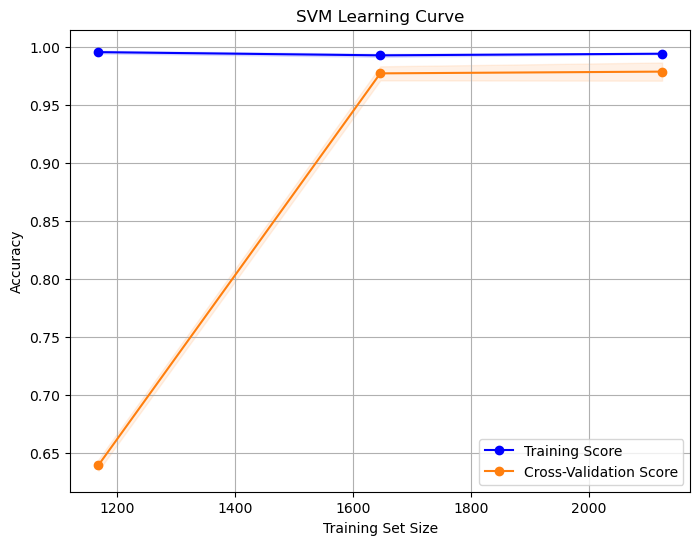
    
- The two curves are close together, suggesting the model generalizes well and is not overfitting. As the training size increases, validation accuracy stabilizes, confirming the model’s strong and reliable performance across the dataset

- Logistic Regression reached around 97.5% accuracy, while SVM slightly improved to about 98.1%. The learning curves for both models show minimal gaps between training and validation scores, indicating low overfitting. However, SVM showed a slightly stronger generalization capability, making it a more robust choice for sentiment classification in this dataset.


#Top words influencing sentiments in our SVM model

# Extract TF-IDF feature names and the trained SVM model
vectorizer = svm_pipeline.named_steps['tfidf']
model = svm_pipeline.named_steps['svm']

feature_names = vectorizer.get_feature_names_out()

# For multi-class SVM, extract coefficients for each class
for i, class_label in enumerate(model.classes_):
    coefficients = model.coef_[i]
    top_positive_words = [feature_names[j] for j in np.argsort(coefficients)[-10:]]
    top_negative_words = [feature_names[j] for j in np.argsort(coefficients)[:10]]

    print(f"\nClass: {class_label}")
    print("Top words influencing positive sentiment:", top_positive_words)
    print("Top words influencing negative sentiment:", top_negative_words)
 
    Class: Negative
    Top words influencing positive sentiment: ['suck', 'suck link', 'sxsw suck', 'attention', 'fail', 'perfect attention', 'attention detail', 'detail rt', 'rt google', 'rt temporary']
    Top words influencing negative sentiment: ['rt apple', 'link', 'rt pop', 'wow rt', 'party', 'love', 'wow', 'great', 'love sxsw', 'quot via']
    
    Class: Neutral
    Top words influencing positive sentiment: ['wow', 'denim', 'sxsw apple', 'gadget', 'launch', 'quot party', 'link photo', 'link sxsw', 'wow rt', 'rt pop']
    Top words influencing negative sentiment: ['rt google', 'detail rt', 'attention detail', 'perfect attention', 'detail', 'perfect', 'attention', 'gt', 'opening', 'apple ipad']
    
    Class: Positive
    Top words influencing positive sentiment: ['love sxsw', 'cool', 'party', 'amp', 'marketing', 'set', 'smart', 'great', 'link', 'love']
    Top words influencing negative sentiment: ['rt temporary', 'link sxsw', 'fail', 'link photo', 'launch', 'want', 'suck', 'suck link', 'sxsw suck', 'sxsw apple']
    

### NAIVE-BAYES


```python
from sklearn.naive_bayes import MultinomialNB
# Build a Nive-Bayes pipeline
nb_pipeline = Pipeline([
    ('tfidf', TfidfVectorizer(max_features=5000, ngram_range=(1, 2))),
    ('nb', MultinomialNB())
])

#Training the pipeline
nb_pipeline.fit(X_train, y_train)

  
## MODELS EVALUATION and SELECTION

# Model evaluation and selction of the best model

```python
#Visualization on the comparison of the models perfomance
results_df.plot(kind='bar', figsize=(9,5), color=['#1f77b4', '#ff7f0e'])
plt.title('Model Comparison: Accuracy & F1-score', fontsize=14)
plt.ylabel('Score')
plt.xticks(rotation=15)
plt.ylim(0, 1.0)
plt.legend(loc='lower right')
plt.grid(axis='y', linestyle='--', alpha=0.7)
plt.show()

best_model = results_df.index[0]
best_acc = results_df.iloc[0, 0]
print(f" Best Model: {best_model} with Accuracy = {best_acc:.4f}")

```


    
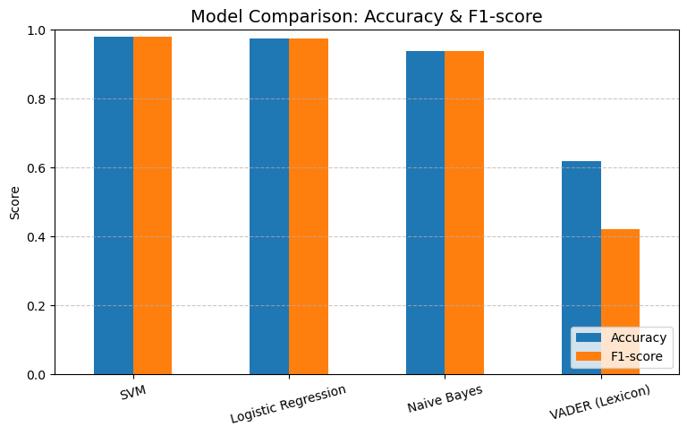
    


     Best Model: SVM with Accuracy = 0.9812
    

From our comparison of all models tested, SVM achieved the highest accuracy of 98.12%, slightly outperforming Logistic Regression of 97.55% and Naive Bayes of 93.97%.
This shows that SVM handled the high-dimensional TF-IDF features most effectively, making it the best overall model for this multiclass sentiment classification task.

# Conclusion and Recomendation

#### Conclusion
- This project explored different models for sentiment analysis, including VADER, Naive Bayes, Logistic Regression, and SVM. The SVM model performed best, achieving an accuracy of 0.9812, showing strong ability to understand patterns in the text. Overall, machine learning models, especially those using TF-IDF features, performed much better than rule-based approaches like VADER.

#### Recommendations
1. Use SVM as Primary model
- SVM achieved the highest performance with an Accuracy and F1-score of 0.98, making it the most reliable for classifying tweets about Apple and Google.
- Business impact: Ideal for real-time sentiment tracking and decision-making due to its high precision and consistency.
2. Use Logistic regression when interpretability matters
- Logistic Regression performed strongly with Accuracy of 0.98 and F1 of 0.97.
- Recommendation: Use alongside SVM when transparency and stakeholder understanding are priorities.
3. Use Naïve Bayes as a supporting model
- Naive Bayes achieved moderate results Accuracy of 0.94
- Recommendation: Suitable lightweight analysis tools, but not for production sentiment monitoring.
4. Use tools like LIME for model interpratability.
5. Keep improving the model with new data to maintain accuracy.

